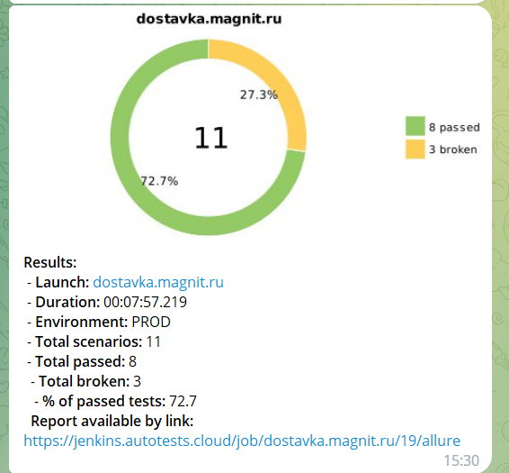
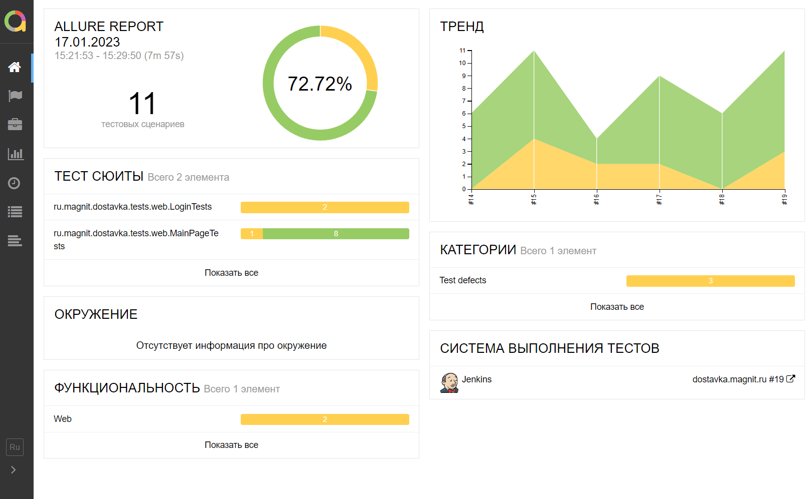
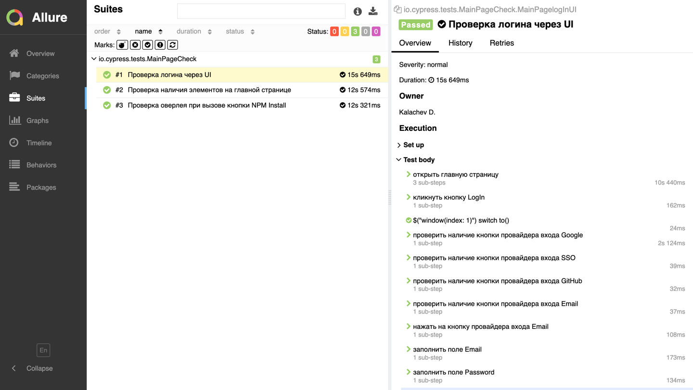
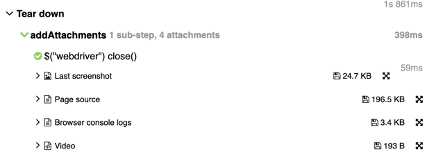
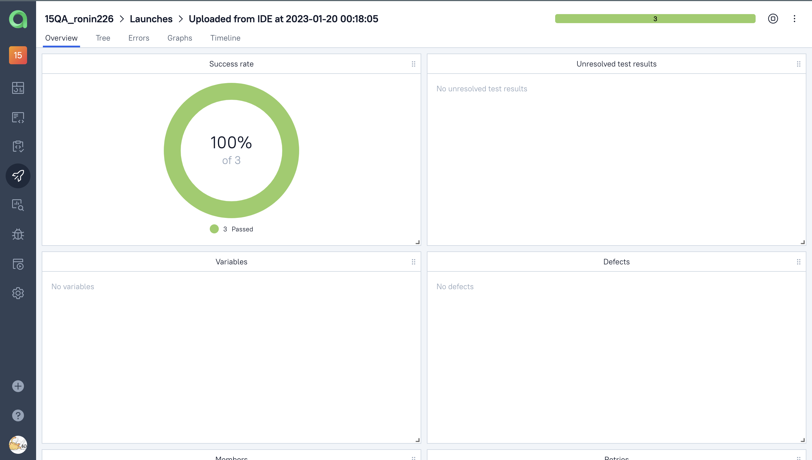
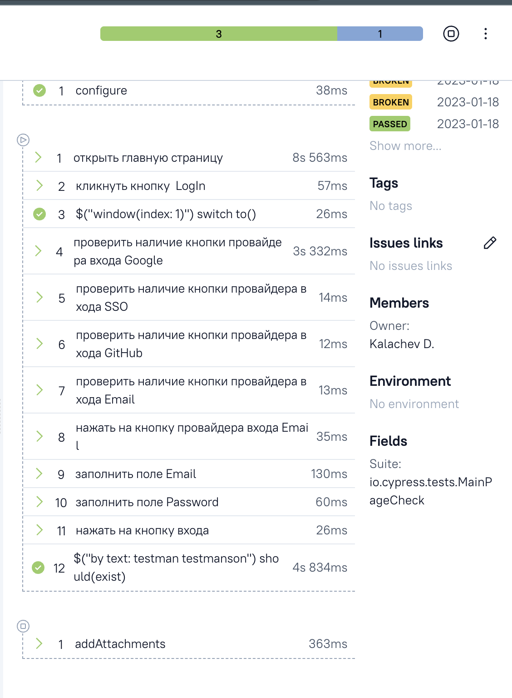

# CypressMainPageUICheck

<h2 align="center">" Учебная работа автотеста главной страницы cypress.io "</h2>
<p  align="center">
<a href="https://www.cypress.io"></a>
</p>

# <a name="Содержание">Содержание</a>
+ [Описание](#Описание)
+ [Технологии и инструменты](#Технологии-и-инструменты)
+ [Варианты запуска](#Варианты-запуска)
    + [Команды для gradle](#команды-для-gradle)
    + [Запуск в Jenkins](#запуск-в-jenkins)
+ [Результаты тестов в Allure Report](#Результаты-тестов-в-Allure-Report)
+ [Интеграция с Allure TestOps](#Интеграция-с-Allure-TestOps)


# <a name="Описание">Описание</a>
Тестовый проект состоит из веб-тестов (UI).\
Краткий список интересных фактов о проекте:
- [x] `Page Object` проектирование
- [x] Динамичный файл конфигурации для запуска теста в зависимости от параметров сборки
- [x] Конфигурация с библиотекой `Owner`
- [x] Интеграция с `Allure TestOps`
- [x] Автотесты как тестовая документация


# <a name="Технологии и инструменты">Технологии и инструменты</a>
<p  align="center">
  <code></code>
  <code></code>
  <code></code>
  <code></code>
  <code></code>
  <code></code>
  <code></code>
  <code></code>
  <code></code>
  <code></code>
  <code></code>
</p>

Автотесты в этом проекте написаны на `Java` использую `Selenide` фреймворк.\
`Gradle` - используется как инструмент автоматизации сборки.  \
`JUnit5` - для выполнения тестов.\
`Jenkins` - CI/CD для запуска тестов удаленно.\
`Selenoid` - для удаленного запуска браузера в `Docker` контейнерах.\
`Allure Report` - для визуализации результатов тестирования.\
`Telegram Bot` - для уведомлений о результатах тестирования.\
`Allure TestOps` - как система управления тестированием.

[Вернуться к оглавлению ⬆](#Содержание)

# <a name="Варианты запуска">Варианты запуска</a>

## <a name="GradleCommand">Команды для Gradle</a>
Для запуска локально и в Jenkins используется следующая команда::
```bash
gradle clean test 
```
Дополнительные параметры:
> `-Dstand=selenoid` `-Dselenoidkey=selenoid passkey` `-Dselenoiduser=selenoid username` - данные для selenoid\
> `-Dusername=имя пользователя` `-Demail=почта пользователя` `-Dpassword=пароль позвателя` - данные для тестовой учетной записи\


[Вернуться к оглавлению ⬆](#Содержание)

## <a name="Запуск в Jenkins">Запуск в [Jenkins](https://jenkins.autotests.cloud/job/15CupressUI/)</a>
Главная страница сборки:
<p  align="center">

</p>

Параметры и личные данные тестовой учетной записи могу быть сохранены как в файле конфигурации в проекте, так и переданы в настройках запуска Jenkins

После завершения сборки результаты тестирования доступны в:
>- <code><strong>*Allure Report*</strong></code>
>- <code><strong>*Allure TestOps*</strong></code> - результаты загружаются туда и тест-кейсы могут автоматически обновляться в соответствии с последними изменениями в коде.

[Вернуться к оглавлению ⬆](#Содержание)

# <a>Telegram уведомления</a>
Telegram-бот отправляет краткий отчет в указанный телеграм-чат по результатам каждой сборки.
<p  align="center">

</p>

[Вернуться к оглавлению ⬆](#Содержание)

# <a name="AllureReport">Результаты тестов в [Allure Report](https://jenkins.autotests.cloud/job/jobname.ru/19/allure/)</a>

## Главная страница
Главная страница отчета Allure содержит следующие блоки:

>- <code><strong>*ALLURE REPORT*</strong></code> - отображает дату и время теста, общее количество запущенных тестов, а также диаграмму с процентом и количеством успешных, упавших и сломавшихся в процессе выполнения тестов
>- <code><strong>*TREND*</strong></code> - отображает тенденцию выполнения тестов для всех запусков
>- <code><strong>*SUITES*</strong></code> - отображает распределение тестов по сьютам
>- <code><strong>*CATEGORIES*</strong></code> - отображает распределение неудачных тестов по типам дефектов
<p align="center">
  
</p>

## Список тестов с шагами и тестовыми артефактами
На странице список тестов, сгруппированных по наборам, с указанием статуса для каждого теста.\
Может быть показана полная информация о каждом тесте: теги, продолжительность, подробные шаги.

<p align="center">
  
</p>

Также доступны дополнительные тестовые артефакты:
>- Screenshot
>- Page Source
>- Video

<p align="left">
  
</p>

[Вернуться к оглавлению ⬆](#Содержание)

# <a>Интеграция с [Allure TestOps](https://allure.autotests.cloud/project/casesurl)</a>
> Ссылка доступна только авторизованным пользователям.


## Allure TestOps Dashboard

<p align="center">
  
</p>


## Allure TestOps Test Cases

Тест-кейсы в проект импортируются из кода,
поэтому нет необходимости в синхронизации ручных тест-кейсов и автотестов.
Достаточно создать и обновить автотест в коде.

<p align="center">
  
</p>

[Вернуться к оглавлению ⬆](#Содержание)

